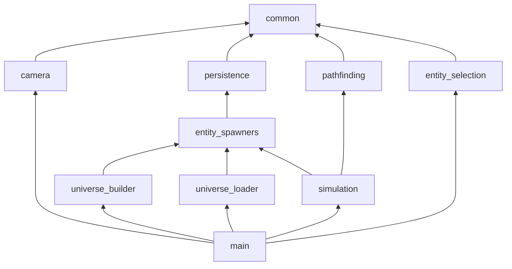

 

An economy focused RTS / Space Sandbox written in Rust and Bevy, highly inspired by games such as AI War and the entirety of the X-Series.

Right now things are still very Work-in-Progressy. I'll be more open to contributions once I've figured out more about the general direction this will take, which includes filling [docs](docs) with a proper game design document. :>

## Crate overview

`main` mostly contains stuff that's still WIP and has not reached a size to warrant a separate crate yet.
Ideally, one day it will just construct the bevy App through plugins.

Have a look at the readme files in the individual crate subfolders for more details.

## License

This project is licensed under the **Creative Commons Attribution-NonCommercial-ShareAlike 4.0 International License (CC BY-NC-SA 4.0)**.

If you find anything that might be useful enough to be upstreamed into any of the crates this project is using as dependencies under one of the more permissive licenses, just create an issue and I will gladly support you in doing so! The same goes for generic functionality which could be extracted into external crates with MIT/Apache Dual Licenses to be useful for other projects in the bevy ecosystem. :)

### Contributing

Right now a lot of things are still changing constantly - my vision for this game isn't set in stone yet, and I'm mostly just "following the fun" whilst learning more about rust and bevy. Once things are more ironed out and set in stone, I might get more open to people contributing stuff, but for now... please don't. :')

So technically, at the moment the best way to support development might be reviewing what I got and giving me hints on how I could do better!

[//]: # (### Your contributions)

[//]: # (Unless you explicitly state otherwise, any contribution intentionally submitted for inclusion in this project by you shall be licensed under the same CC BY-NC-SA 4.0 license and may also be upstreamed under more permissive licenses to further support the bevy ecosystem, as mentioned previously.)

[//]: # (Furthermore, by contributing, you agree that if I start accepting donations through any means which do not affect the general availability and accessibility of the game and any of its content in any way &#40;such as Patreon, Ko-Fi, GitHub Sponsors, "Pay what you want" on itch.io, some kind of tip jar without in-game rewards on Steam&#41; in the future, it doesn't violate the Non-Commercial use clause of this license.)
